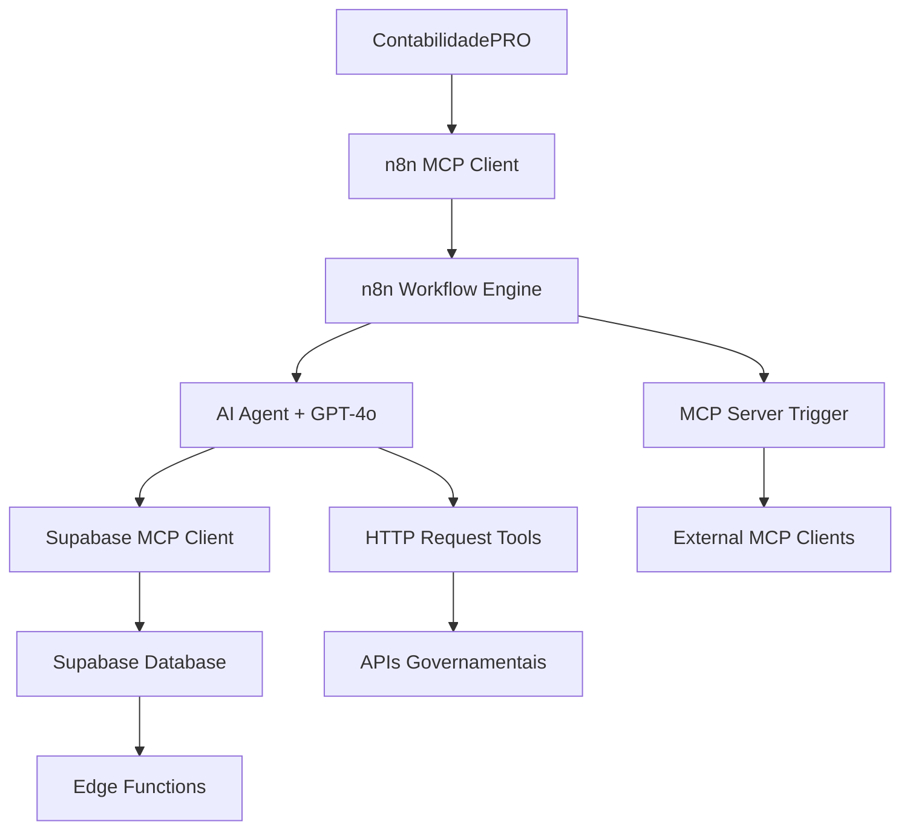

# Estudo: Implementação de Workflow n8n para Coleta de Dados Contábeis

## 📋 Resumo Executivo

Este documento apresenta um estudo completo sobre a implementação de um workflow no n8n para automatizar a coleta de dados necessários para integração com sistemas governamentais brasileiros. O workflow utiliza um agente de IA conversacional para guiar contadoras através do processo de coleta de informações críticas de forma intuitiva e eficiente.

## 🎯 Objetivo

Criar um sistema automatizado que:
- Colete informações necessárias para integrações fiscais
- Use IA conversacional para guiar o usuário
- Estruture dados coletados em formato padronizado
- Integre com o sistema ContabilidadePRO existente

## 🔍 Análise de Requisitos

### Informações Essenciais para Coleta

#### 1. **Certificados Digitais**
- Tipo: A1 (arquivo .pfx) ou A3 (token/cartão)
- Arquivo PFX + senha (para A1)
- Driver + senha (para A3)
- Data de validade
- CNPJs vinculados ao certificado

#### 2. **Dados da Empresa**
- CNPJ completo
- Razão social
- Inscrição Estadual
- Inscrição Municipal
- CNAE principal
- Regime tributário (Simples Nacional/Lucro Real/Presumido)

#### 3. **Credenciais de Acesso**
- **e-CAC (Receita Federal)**
  - Usuário/senha ou certificado
- **SEFAZ Estadual**
  - Usuário/senha específico de cada estado
- **Prefeitura (NFSe)**
  - Credenciais municipais

#### 4. **Configurações Fiscais**
- Próximo número de NFe/NFCe
- Série das notas fiscais
- CSTs (Código de Situação Tributária) utilizados
- CSOSNs (Simples Nacional) utilizados
- Ambiente (produção/homologação)

#### 5. **Dados Bancários**
- Contas para conciliação automática
- Histórico de movimentações recentes

#### 6. **Informações de Contato**
- E-mail para notificações
- Telefone para alertas
- Responsável técnico nos órgãos

## 🏗️ Arquitetura da Solução

### Stack Tecnológico
- **n8n v2.13.0**: Orquestrador de workflows (localhost:5678)
  - 525 nós disponíveis total
  - 263 nós otimizados para IA
  - 104 triggers disponíveis
  - MCP Server integration habilitado
- **OpenAI GPT-4o**: Modelo de linguagem para conversação
- **Supabase**: Backend completo (PostgreSQL + Auth + Storage + Edge Functions)
  - Row Level Security (RLS) habilitado
  - Real-time subscriptions
  - Edge Functions para processamento
- **ContabilidadePRO**: Sistema principal (Next.js 15 + React 19)
  - Integração via MCP tools (n8n, Supabase, Context-7)
  - Playwright para automação de testes

### Fluxo de Dados
```
ContabilidadePRO → Webhook n8n → AI Agent → AI Transform → Supabase → Resposta
                                    ↓
                            HTTP Request Tool
                           (Consultas Gov.)
```

## 🔧 Implementação do Workflow

### Ambiente n8n Configurado
- **Instância**: http://localhost:5678 (ativa e conectada)
- **Versão**: v2.13.0 com suporte completo a MCP
- **API Status**: Configurada e funcionando
- **Community Packages**: `N8N_COMMUNITY_PACKAGES_ALLOW_TOOL_USAGE=true`
- **Database**: 87% dos nós possuem documentação completa
- **AI Tools**: 263 nós podem ser usados como ferramentas de IA

### Workflow Criado: "Coleta Dados Contadora - IA Agent"
- **URL**: `http://localhost:5678/workflow/JBW7i0uTyAl1Jk7s`
- **Webhook**: `http://localhost:5678/webhook/coleta-dados-contadora` (POST)
- **Status**: ✅ Estrutura básica implementada

### Nós Implementados

#### 1. **Webhook Trigger** ✅
```json
{
  "method": "POST",
  "path": "coleta-dados-contadora",
  "authentication": "none",
  "respond": "immediately"
}
```

#### 2. **AI Agent** ✅
- **Tipo**: Tools Agent
- **Conexões necessárias**:
  - Chat Model (OpenAI GPT-4o)
  - Tools (HTTP Request Tool)
  - Memory (opcional)

#### 3. **Nós Planejados** 📋
- **OpenAI Chat Model**: Modelo de linguagem
- **HTTP Request Tool**: Consultas à Receita Federal
- **AI Transform**: Estruturação de dados
- **Supabase**: Persistência
- **Respond to Webhook**: Resposta final

## 🤖 Configuração do AI Agent

### System Prompt Recomendado
```
Você é um assistente especializado em coleta de dados contábeis brasileiros.

Sua missão é obter as seguintes informações da contadora de forma conversacional:

**DADOS ESSENCIAIS:**
1. Certificados digitais (A1/A3) + senhas
2. CNPJ, Inscrição Estadual, Inscrição Municipal
3. Credenciais e-CAC, SEFAZ, Prefeitura
4. Regime tributário (Simples/Lucro Real/Presumido)
5. Dados bancários para conciliação
6. Próximo número de NFe/NFCe
7. CSTs/CSOSNs utilizados

**INSTRUÇÕES:**
- Faça UMA pergunta por vez
- Seja específico e didático
- Confirme cada resposta antes de prosseguir
- Explique PARA QUE serve cada informação
- Use linguagem contábil apropriada
- Mantenha contexto da conversa anterior

Comece perguntando qual empresa será configurada (razão social + CNPJ).
```

### Tools Configuradas

#### HTTP Request Tool - Receita Federal
```json
{
  "name": "consulta_receita_federal",
  "description": "Consulta dados da Receita Federal (CNPJ, CPF, situação cadastral)",
  "method": "GET",
  "url": "https://receitaws.com.br/v1/cnpj/{{ $parameter.cnpj }}",
  "placeholders": [
    {
      "name": "cnpj",
      "description": "CNPJ para consulta (apenas números)"
    }
  ],
  "optimize_response": true,
  "response_type": "JSON",
  "max_response_characters": 1000
}
```

#### Configurações Adicionais de Tools
```json
{
  "tools_config": {
    "environment_variable": "N8N_COMMUNITY_PACKAGES_ALLOW_TOOL_USAGE=true",
    "ai_tool_capabilities": {
      "can_be_used_as_tool": true,
      "tool_connection_type": "ai_tool",
      "common_use_cases": [
        "Consultar APIs governamentais",
        "Validar dados fiscais",
        "Processar documentos XML/SOAP",
        "Integrar com sistemas externos"
      ]
    }
  }
}
```

## 📊 Estrutura de Dados de Saída

### JSON Schema para AI Transform
```json
{
  "empresa": {
    "razao_social": "",
    "cnpj": "",
    "inscricao_estadual": "",
    "inscricao_municipal": "",
    "regime_tributario": ""
  },
  "certificados": {
    "tipo": "A1 ou A3",
    "arquivo_pfx": "",
    "senha": "",
    "validade": ""
  },
  "credenciais": {
    "ecac_usuario": "",
    "ecac_senha": "",
    "sefaz_usuario": "",
    "sefaz_senha": "",
    "prefeitura_usuario": "",
    "prefeitura_senha": ""
  },
  "configuracoes_fiscais": {
    "proximo_numero_nfe": "",
    "serie_nfe": "",
    "csts_utilizados": [],
    "csosns_utilizados": []
  },
  "dados_bancarios": [],
  "status": "coletado",
  "observacoes": ""
}
```

## 🔗 Integrações Governamentais Possíveis

### APIs e Webservices Identificados
1. **SPED (Sistema Público de Escrituração Digital)**
   - ECD, ECF, EFD-ICMS/IPI
   - Webservices SOAP/XML

2. **NFe (Nota Fiscal Eletrônica)**
   - Autorização, Consulta, Cancelamento
   - SEFAZ de cada estado

3. **eSocial**
   - Eventos trabalhistas
   - API REST/SOAP

4. **EFD-Reinf**
   - Retenções fiscais
   - Webservice dedicado

5. **DCTFWeb**
   - Declaração de débitos e créditos
   - Portal RFB

### Nós n8n Relevantes para Integrações

#### Core Nodes (n8n-nodes-base)
- **HTTP Request** (`nodes-base.httpRequest`): APIs RESTful governamentais
  - Suporta Bearer, OAuth2, Basic Auth
  - Pagination automática
  - Circuit breaker pattern
  - Response optimization para IA
- **XML** (`nodes-base.xml`): Processamento SOAP/XML
  - Conversão JSON ↔ XML
  - Suporte a namespaces
  - Validação de schemas
- **Webhook** (`nodes-base.webhook`): Recebimento de notificações
  - Autenticação configurável
  - Response modes flexíveis
  - Path personalizado
- **Cron** (`nodes-base.cron`): Agendamento de consultas
  - Expressões cron avançadas
  - Timezone support
- **AI Transform** (`nodes-base.aiTransform`): Processamento inteligente
  - Instruções em linguagem natural
  - Structured data output
- **Supabase** (`nodes-base.supabase`): Integração nativa
  - CRUD operations
  - Real-time subscriptions
  - RLS compliance

#### AI/LangChain Nodes (@n8n/n8n-nodes-langchain)
- **AI Agent** (`nodes-langchain.agent`): Agente conversacional principal
- **OpenAI Chat Model** (`nodes-langchain.lmChatOpenAi`): GPT-4o integration
- **HTTP Request Tool** (`nodes-langchain.toolHttpRequest`): Ferramenta para agente
- **MCP Server Trigger** (`nodes-langchain.mcpTrigger`): Exposição como MCP Server
- **MCP Client Tool** (`nodes-langchain.mcpClientTool`): Conexão com outros MCP servers

## 🔗 Integração Supabase Detalhada

### Configuração do Projeto
- **URL da API**: Configurada nas variáveis de ambiente
- **Chaves de Acesso**:
  - `NEXT_PUBLIC_SUPABASE_ANON_KEY`: Cliente (RLS enforced)
  - `SUPABASE_SERVICE_ROLE_KEY`: Edge Functions (bypass RLS)

### Tabelas Necessárias
```sql
-- Tabela principal para dados coletados
CREATE TABLE dados_contadora (
  id UUID DEFAULT gen_random_uuid() PRIMARY KEY,
  user_id UUID REFERENCES auth.users(id) NOT NULL,
  empresa JSONB NOT NULL,
  certificados JSONB,
  credenciais JSONB,
  configuracoes_fiscais JSONB,
  dados_bancarios JSONB,
  status VARCHAR(50) DEFAULT 'coletado',
  observacoes TEXT,
  created_at TIMESTAMP WITH TIME ZONE DEFAULT NOW(),
  updated_at TIMESTAMP WITH TIME ZONE DEFAULT NOW()
);

-- Habilitar RLS
ALTER TABLE dados_contadora ENABLE ROW LEVEL SECURITY;

-- Política RLS - usuários só veem seus dados
CREATE POLICY "Usuários veem apenas seus dados" ON dados_contadora
  FOR ALL USING (auth.uid() = user_id);

-- Tabela para log de conversações
CREATE TABLE conversacoes_coleta (
  id UUID DEFAULT gen_random_uuid() PRIMARY KEY,
  dados_contadora_id UUID REFERENCES dados_contadora(id),
  mensagem TEXT NOT NULL,
  role VARCHAR(20) NOT NULL, -- 'user', 'assistant', 'system'
  timestamp TIMESTAMP WITH TIME ZONE DEFAULT NOW()
);
```

### Edge Functions Integradas
- **assistente-contabil-ia**: Processamento de IA especializado
- **documentos-service**: Unificação de processamento de documentos
- **empresa-context-service**: Contexto rico de empresas
- **monitoring-dashboard**: Métricas em tempo real
- **security-service**: Monitoramento de segurança

### Tipos TypeScript Gerados
```typescript
// Auto-gerado via supabase gen types
export interface DadosContadora {
  id: string;
  user_id: string;
  empresa: {
    razao_social: string;
    cnpj: string;
    inscricao_estadual?: string;
    inscricao_municipal?: string;
    regime_tributario: string;
  };
  certificados?: {
    tipo: 'A1' | 'A3';
    arquivo_pfx?: string;
    senha: string;
    validade: string;
  };
  // ... outros campos
  status: string;
  created_at: string;
  updated_at: string;
}
```

## 🔒 Considerações de Segurança

### Dados Sensíveis
- Senhas de certificados digitais
- Credenciais de acesso a portais
- Informações fiscais confidenciais

### Medidas de Proteção
- Armazenamento criptografado no Supabase
- Transmissão via HTTPS
- Logs com dados mascarados
- Rotação periódica de credenciais

## 📈 Casos de Uso Específicos

### 1. **Onboarding de Nova Empresa**
- Coleta completa de dados
- Validação via APIs governamentais
- Setup automático no sistema

### 2. **Atualização de Credenciais**
- Renovação de certificados
- Mudança de senhas
- Teste de conectividade

### 3. **Migração de Sistema**
- Export de configurações existentes
- Import estruturado
- Validação pós-migração

## 🧪 Cenários de Teste

### Fluxo Básico
1. **Trigger**: POST para webhook
2. **Input**: `{"empresa": "Teste LTDA", "solicitante": "Contador X"}`
3. **Processo**: Conversação guiada
4. **Output**: Dados estruturados + confirmação

### Casos Edge
- Certificados vencidos
- Credenciais inválidas
- Empresas com múltiplas inscrições
- Interrupção da conversação

## 📊 Métricas de Sucesso

### KPIs Funcionais
- Taxa de conclusão da coleta: > 90%
- Tempo médio de coleta: < 15 min
- Precisão dos dados: > 95%
- Satisfação do usuário: > 4.5/5

### KPIs Técnicos
- Uptime do workflow: > 99%
- Tempo de resposta: < 2s
- Taxa de erro: < 1%

## 🚀 Roadmap de Implementação

### Fase 1 - MVP ✅
- [x] Criação do workflow base
- [x] Webhook configurado
- [x] AI Agent estruturado
- [x] Documentação inicial

### Fase 2 - Configuração 📋
- [ ] Configurar OpenAI Chat Model
- [ ] Implementar HTTP Request Tools
- [ ] Setup AI Transform
- [ ] Integrar Supabase
- [ ] Testes básicos

### Fase 3 - Refinamento 📋
- [ ] Otimizar prompts
- [ ] Adicionar validações
- [ ] Implementar error handling
- [ ] Testes de carga

### Fase 4 - Produção 📋
- [ ] Deploy em ambiente produtivo
- [ ] Monitoramento e alertas
- [ ] Documentação do usuário
- [ ] Treinamento da equipe

## 💡 Próximos Passos Imediatos

1. **Configurar Chat Model OpenAI**
   - Adicionar credenciais da API
   - Selecionar modelo GPT-4o
   - Configurar parâmetros

2. **Implementar Tools**
   - HTTP Request Tool para Receita Federal
   - Validação de CNPJ/CPF
   - Consulta de situação cadastral

3. **Testar Workflow**
   - Execução manual
   - Validação de respostas
   - Ajuste de prompts

4. **Integrar com ContabilidadePRO**
   - Endpoint no sistema principal
   - Processamento de respostas
   - Interface do usuário

## 🛠️ Ferramentas MCP Integradas

### n8n MCP Tools
- **Estatísticas**: 525 nós total, 263 AI tools, 87% documentação
- **Validação**: Configuração automática e validação de nós
- **Templates**: Biblioteca de workflows pré-configurados
- **Gerenciamento**: Criação, atualização e execução via MCP

### Supabase MCP Tools
- **Projetos**: Listagem e gerenciamento via MCP
- **Tabelas**: Consulta de estruturas e dados
- **Migrações**: Aplicação automática de DDL
- **Edge Functions**: Deploy e monitoramento
- **Tipos**: Geração automática de TypeScript

### Context-7 MCP Integration
- **Documentação**: Acesso a docs atualizadas de bibliotecas
- **Suporte**: Next.js, Supabase, n8n, OpenAI
- **Exemplos**: Code snippets contextualizados

### Playwright MCP Tools
- **Automação**: Testes end-to-end
- **Screenshots**: Capturas automáticas
- **Navegação**: Interação com interfaces web

## 📊 Métricas e Monitoramento

### n8n Workflow Analytics
```javascript
// Métricas disponíveis via MCP
const workflowStats = {
  executions: {
    total: 0,
    successful: 0,
    failed: 0,
    rate: '0%'
  },
  performance: {
    avg_runtime: '0s',
    timeout_rate: '0%'
  },
  usage: {
    nodes_count: 6,
    ai_tools_count: 3
  }
};
```

### Supabase Monitoring
```sql
-- Queries de monitoramento
SELECT
  COUNT(*) as total_coletas,
  COUNT(CASE WHEN status = 'completed' THEN 1 END) as concluidas,
  AVG(EXTRACT(EPOCH FROM (updated_at - created_at))) as tempo_medio
FROM dados_contadora
WHERE created_at > NOW() - INTERVAL '24 hours';
```

## 📚 Recursos de Referência

### Documentação Técnica
- [n8n AI Agent Documentation](https://docs.n8n.io/integrations/builtin/cluster-nodes/root-nodes/n8n-nodes-langchain.agent/)
- [n8n MCP Server Documentation](https://github.com/czlonkowski/n8n-mcp)
- [OpenAI API Reference](https://platform.openai.com/docs/api-reference)
- [Supabase Documentation](https://supabase.com/docs)
- [Supabase MCP Tools](https://docs.supabase.com/guides/cli)

### APIs Governamentais
- [ReceitaWS - Consulta CNPJ](https://receitaws.com.br/)
- [Portal do Simples Nacional](https://www8.receita.fazenda.gov.br/simplesnacional/)
- [Documentação SPED](https://www.gov.br/receitafederal/pt-br/assuntos/orientacao-tributaria/declaracoes-e-demonstrativos/sped)
- [NFe Portal Nacional](https://www.nfe.fazenda.gov.br/)
- [eSocial Portal](https://www.gov.br/esocial/pt-br)

### Frameworks e Bibliotecas
- [LangChain Documentation](https://js.langchain.com/docs/)
- [Next.js 15 Documentation](https://nextjs.org/docs)
- [Tailwind CSS](https://tailwindcss.com/docs)
- [Playwright Documentation](https://playwright.dev/)
- [MCP Protocol Specification](https://modelcontextprotocol.io/)

---

## 🔄 Arquitetura MCP (Model Context Protocol)

### Fluxo de Dados Expandido


### Benefícios da Arquitetura MCP
1. **Interoperabilidade**: Comunicação padronizada entre ferramentas
2. **Escalabilidade**: Adição fácil de novos serviços
3. **Observabilidade**: Monitoramento unificado
4. **Debugging**: Rastreamento completo de requests
5. **Reutilização**: Workflows como serviços MCP

---

**Documento criado em**: 2025-09-24
**Última atualização**: 2025-09-24
**Versão**: 2.0
**Autor**: Claude Code Assistant
**Status**: Em Implementação ✅
**Workflow URL**: http://localhost:5678/workflow/JBW7i0uTyAl1Jk7s
**MCP Tools**: n8n, Supabase, Context-7, Playwright integrados
**Environment**: Windows 11, Docker containers, localhost development