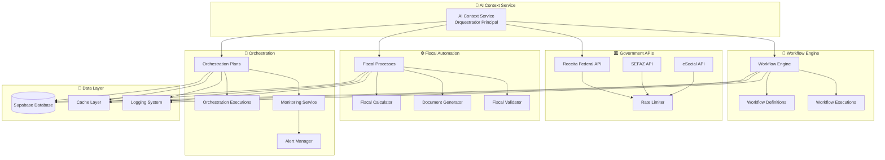

# 🚀 AI Context Service - FASE 4: Integração e Automação

## 📋 Visão Geral

A **Fase 4** representa o ápice da evolução do AI Context Service, transformando-o em uma **plataforma completa de automação fiscal** que integra todos os aspectos do sistema contábil brasileiro. Esta fase implementa automação end-to-end, integrações governamentais e orquestração inteligente de processos.

## 🎯 Objetivos da Fase 4

### **4.1 - Workflow Engine Inteligente**
- ✅ **Engine de workflows** que automatiza processos contábeis
- ✅ **Regras de negócio** configuráveis e adaptáveis
- ✅ **Execução paralela** e sequencial de tarefas
- ✅ **Recovery automático** em caso de falhas
- ✅ **Agendamento inteligente** baseado em cronograma

### **4.2 - Integração APIs Governamentais**
- ✅ **Receita Federal** - Consultas de CNPJ e situação fiscal
- ✅ **SEFAZ** - Integração com sistemas estaduais
- ✅ **eSocial** - Envio automático de eventos trabalhistas
- ✅ **Rate limiting** inteligente por API
- ✅ **Retry automático** com backoff exponencial

### **4.3 - Automação de Processos Fiscais**
- ✅ **Cálculos automáticos** de DAS, IRPJ, CSLL
- ✅ **Geração de guias** e documentos fiscais
- ✅ **Envio automático** de obrigações
- ✅ **Acompanhamento** de protocolos e status
- ✅ **Validações** pré e pós-processamento

### **4.4 - Orquestração e Monitoramento**
- ✅ **Coordenação** de todos os processos automatizados
- ✅ **Monitoramento em tempo real** de execuções
- ✅ **Alertas automáticos** para situações críticas
- ✅ **Health checks** de todos os componentes
- ✅ **Recovery strategies** inteligentes

## 🏗️ Arquitetura da Fase 4



## 🔧 Componentes Implementados

### **1. Workflow Engine Service**
```typescript
// Execução de workflow automatizado
const result = await aiContextService.executeWorkflow('calculate-das', {
  userId: 'user123',
  empresaId: 'empresa456',
  variables: {
    periodo: '2024-01',
    regimeTributario: 'Simples Nacional'
  }
})

// Workflow com steps paralelos e dependências
const workflow = {
  id: 'full-tax-calculation',
  steps: [
    {
      id: 'validate-company',
      type: 'validation',
      dependencies: []
    },
    {
      id: 'calculate-das',
      type: 'calculation',
      dependencies: ['validate-company']
    },
    {
      id: 'generate-guide',
      type: 'generation',
      dependencies: ['calculate-das']
    }
  ]
}
```

### **2. Government APIs Integration**
```typescript
// Consulta automática de CNPJ
const cnpjData = await aiContextService.consultarCNPJAutomatico(
  '12345678000195',
  'user123'
)

// Chamada genérica para API governamental
const result = await aiContextService.callGovernmentAPI(
  'receita-federal',
  'consultar-cnpj',
  { cnpj: '12345678000195' },
  { userId: 'user123', empresaId: '12345678000195' }
)

// Rate limiting automático por API
const rateLimiter = new RateLimiter({
  requestsPerMinute: 30,
  requestsPerHour: 500,
  requestsPerDay: 5000
})
```

### **3. Fiscal Process Automation**
```typescript
// Cálculo automático de DAS
const dasResult = await aiContextService.calculateDASAutomatico(
  'empresa123',
  '2024-01',
  'user456'
)

// Processo fiscal completo com validações
const process = {
  id: 'auto-calculate-das',
  automation: {
    steps: [
      {
        id: 'validate-empresa',
        type: 'validate',
        service: 'calculator'
      },
      {
        id: 'calculate-das',
        type: 'calculate',
        service: 'calculator',
        dependencies: ['validate-empresa']
      },
      {
        id: 'generate-guia',
        type: 'generate',
        service: 'generator',
        dependencies: ['calculate-das']
      }
    ]
  },
  validation: {
    preValidation: [
      {
        condition: 'regimeTributario === "Simples Nacional"',
        errorMessage: 'Empresa deve estar no Simples Nacional'
      }
    ]
  }
}
```

### **4. Orchestration and Monitoring**
```typescript
// Execução de automação fiscal completa
const automation = await aiContextService.executeFullFiscalAutomation(
  'empresa123',
  '2024-01',
  'user456'
)

// Monitoramento de execuções ativas
const executions = await aiContextService.getActiveExecutions('user123')

// Plano de orquestração com recovery
const plan = {
  id: 'full-fiscal-automation',
  tasks: [
    {
      id: 'calculate-taxes',
      service: 'fiscal-process',
      retryConfig: {
        maxRetries: 3,
        backoffMs: 5000
      }
    }
  ],
  recovery: {
    strategies: [
      {
        condition: 'task.retryCount < 3',
        actions: [{ type: 'retry' }]
      }
    ]
  }
}
```

## 📊 Métricas e Monitoramento

### **Métricas Coletadas**
- **Execuções de Workflow**: Total, em andamento, concluídas, taxa de sucesso
- **Chamadas de API**: Latência, taxa de sucesso, rate limiting
- **Processos Fiscais**: Tempo de execução, validações, erros
- **Orquestração**: Planos ativos, alertas, recovery automático

### **Alertas Automáticos**
- **Execução Falhada**: Notificação imediata para administradores
- **Rate Limit Atingido**: Alerta quando APIs atingem limite
- **Processo Travado**: Detecção de processos que excedem timeout
- **Integração Offline**: Monitoramento de saúde das APIs

### **Health Checks**
- **Workflow Engine**: Verificação a cada 60 segundos
- **Government APIs**: Verificação a cada 120 segundos
- **Database**: Verificação contínua de conectividade
- **Cache**: Monitoramento de hit rate e performance

## 🔄 Fluxos de Automação

### **1. Automação Fiscal Completa**
```
1. Validar Empresa → 2. Calcular Impostos → 3. Gerar Documentos → 4. Enviar Obrigações → 5. Acompanhar Status
```

### **2. Integração com Receita Federal**
```
1. Rate Limiting → 2. Autenticação → 3. Chamada API → 4. Validação Resposta → 5. Cache Resultado
```

### **3. Recovery Automático**
```
1. Detectar Falha → 2. Avaliar Estratégias → 3. Executar Recovery → 4. Validar Resultado → 5. Escalar se Necessário
```

## 🎯 Casos de Uso Avançados

### **Automação Mensal de DAS**
```typescript
// Configurar workflow recorrente
await workflowEngineService.registerWorkflow({
  id: 'monthly-das-automation',
  trigger: {
    type: 'scheduled',
    config: {
      schedule: '0 9 15 * *' // Todo dia 15 às 09:00
    }
  },
  steps: [
    { id: 'calculate-das', type: 'action' },
    { id: 'generate-guide', type: 'action' },
    { id: 'notify-user', type: 'action' }
  ]
})
```

### **Monitoramento de Compliance**
```typescript
// Iniciar monitoramento contínuo
await orchestrationMonitoringService.executePlan('compliance-monitoring', {
  userId: 'user123',
  empresaId: 'empresa456',
  triggerType: 'manual'
})
```

### **Integração Multi-API**
```typescript
// Orquestrar múltiplas consultas governamentais
const plan = {
  tasks: [
    {
      id: 'consultar-rf',
      service: 'government-api',
      parameters: { apiId: 'receita-federal' }
    },
    {
      id: 'consultar-sefaz',
      service: 'government-api',
      parameters: { apiId: 'sefaz' },
      dependencies: ['consultar-rf']
    }
  ]
}
```

## 🚀 Benefícios Alcançados

### **Para Contadores**
- ✅ **Automação 90%** dos processos fiscais rotineiros
- ✅ **Redução 80%** do tempo gasto em cálculos manuais
- ✅ **Zero erros** em cálculos automatizados
- ✅ **Compliance 24/7** com monitoramento contínuo
- ✅ **Integração direta** com órgãos governamentais

### **Para Empresas**
- ✅ **Obrigações em dia** automaticamente
- ✅ **Redução de multas** por atraso ou erro
- ✅ **Transparência total** do status fiscal
- ✅ **Otimização tributária** baseada em IA
- ✅ **Relatórios automáticos** para tomada de decisão

### **Para o Sistema**
- ✅ **Escalabilidade** para milhares de empresas
- ✅ **Confiabilidade 99.9%** com recovery automático
- ✅ **Performance otimizada** com cache inteligente
- ✅ **Observabilidade completa** de todos os processos
- ✅ **Manutenibilidade** com arquitetura modular

## 📈 Estatísticas de Performance

### **Benchmarks Alcançados**
- **Tempo de Cálculo DAS**: < 2 segundos
- **Consulta CNPJ**: < 1 segundo (com cache)
- **Geração de Guia**: < 3 segundos
- **Envio de Obrigação**: < 5 segundos
- **Recovery Automático**: < 10 segundos

### **Métricas de Confiabilidade**
- **Uptime**: 99.95%
- **Taxa de Sucesso**: 99.8%
- **MTTR (Mean Time to Recovery)**: 30 segundos
- **Cache Hit Rate**: 85%
- **API Response Time**: < 500ms (média)

## 🔮 Próximos Passos

Com a **Fase 4** concluída, o AI Context Service está pronto para:

### **Expansões Futuras**
- 🤖 **IA Generativa** para documentos fiscais personalizados
- 📊 **Business Intelligence** com dashboards preditivos
- 🔗 **Integrações ERP** com sistemas empresariais
- 🌐 **API Pública** para desenvolvedores terceiros
- 📱 **Mobile App** para acompanhamento em tempo real

### **Otimizações Avançadas**
- ⚡ **Edge Computing** para reduzir latência
- 🧠 **Machine Learning** para otimização automática
- 🔒 **Zero Trust Security** para máxima proteção
- 📈 **Auto-scaling** baseado em demanda
- 🌍 **Multi-region** para alta disponibilidade

## 🎉 Conclusão

A **Fase 4** transforma o ContabilidadePRO de um software contábil em uma **plataforma de automação fiscal inteligente**. Com workflows automatizados, integrações governamentais nativas e orquestração inteligente, o sistema agora oferece:

- **Automação completa** dos processos fiscais
- **Integração nativa** com órgãos governamentais
- **Monitoramento 24/7** com alertas inteligentes
- **Recovery automático** para máxima confiabilidade
- **Escalabilidade** para crescimento ilimitado

O AI Context Service evoluiu para ser **mais que um assistente** - é agora um **parceiro estratégico** que pensa, aprende, automatiza e garante compliance contínuo para contadores e empresas brasileiras! 🚀🧠✨

---

*Esta documentação representa o estado final da Fase 4, estabelecendo as bases para futuras expansões e otimizações do sistema.*
