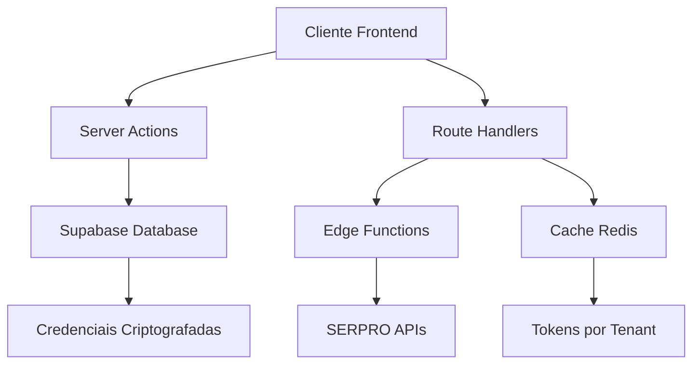

# Integração SERPRO - Documentação para Implementação Futura

Este documento fornece o roadmap completo para implementação da integração com as APIs do SERPRO no ContabilidadePRO, incluindo arquitetura multi-tenant, requisitos técnicos e guia de implementação.

## 📋 Índice

- [Visão Geral](#visão-geral)
- [Arquitetura Multi-Tenant](#arquitetura-multi-tenant)
- [Requisitos Técnicos](#requisitos-técnicos)
- [Estrutura de Implementação](#estrutura-de-implementação)
- [Segurança e Compliance](#segurança-e-compliance)
- [Fluxo de Integração](#fluxo-de-integração)
- [APIs SERPRO Disponíveis](#apis-serpro-disponíveis)
- [Implementação por Fases](#implementação-por-fases)
- [Testes e Validação](#testes-e-validação)
- [Documentação de Acesso](#documentação-de-acesso)

## Visão Geral

### Objetivo
Integrar as APIs do SERPRO (Serviço Federal de Processamento de Dados) ao ContabilidadePRO para fornecer validação automática de dados governamentais, compliance fiscal e acesso a informações oficiais.

### Benefícios
- ✅ **Validação automática** de CNPJ/CPF em tempo real
- ✅ **Compliance automático** com dados oficiais
- ✅ **Redução de riscos** fiscais e de auditoria
- ✅ **Diferencial competitivo** no mercado contábil
- ✅ **Automação de processos** governamentais

### Modelo de Negócio
- **Multi-tenant**: Cada cliente fornece suas próprias credenciais SERPRO
- **White-label**: Sistema adaptável para diferentes escritórios contábeis
- **Escalável**: Suporte a milhares de usuários simultâneos

## Arquitetura Multi-Tenant

### Padrão Arquitetural: Backend-for-Frontend (BFF) Híbrido



### Componentes Principais

#### 1. **Server Actions**
- Configuração de credenciais
- Validações síncronas (UX otimizada)
- Operações de formulário

#### 2. **Route Handlers (BFF)**
- Proxy seguro para APIs SERPRO
- Gerenciamento de tokens por tenant
- Cache inteligente

#### 3. **Edge Functions**
- Processamento em lote
- Operações assíncronas
- Webhooks e integrações

#### 4. **Banco de Dados (Multi-tenant)**
- Credenciais criptografadas por usuário
- Row Level Security (RLS)
- Auditoria completa

## Requisitos Técnicos

### Credenciais SERPRO (Por Cliente)
```bash
# Variáveis de ambiente por tenant (armazenadas criptografadas no banco)
SERPRO_CONSUMER_KEY_[USER_ID]=sua-consumer-key
SERPRO_CONSUMER_SECRET_[USER_ID]=sua-consumer-secret

# Configurações globais
SERPRO_TOKEN_ENDPOINT=https://gateway.apiserpro.serpro.gov.br/token
SERPRO_BASE_URL=https://gateway.apiserpro.serpro.gov.br
```

### Dependências do Projeto
```json
{
  "dependencies": {
    "@supabase/supabase-js": "^2.57.4",
    "crypto": "^1.0.1",
    "zod": "^4.1.8"
  }
}
```

### Extensões PostgreSQL Necessárias
- **pgsodium** - Criptografia de credenciais
- **pgcrypto** - Funções criptográficas
- **pgaudit** - Auditoria de acessos
- **http** - Cliente HTTP nativo
- **pg_cron** - Renovação automática de tokens

## Estrutura de Implementação

### Estrutura de Diretórios
```
contador-solo-ai/
├── src/
│   ├── app/
│   │   ├── api/serpro/
│   │   │   ├── auth/route.ts              # Gerenciamento de tokens
│   │   │   ├── cnpj/route.ts              # Validação CNPJ
│   │   │   ├── cpf/route.ts               # Validação CPF
│   │   │   ├── veiculos/route.ts          # Consulta veículos
│   │   │   └── infrações/route.ts         # Infrações de trânsito
│   │   ├── configuracoes/serpro/
│   │   │   ├── page.tsx                   # Interface de configuração
│   │   │   └── actions.ts                 # Server Actions
│   │   └── clientes/[id]/validacao/
│   │       └── page.tsx                   # Validação automática
│   ├── lib/serpro/
│   │   ├── client.ts                      # Cliente base SERPRO
│   │   ├── token-manager.ts               # Gerenciamento de tokens
│   │   ├── tenant-manager.ts              # Gerenciamento multi-tenant
│   │   ├── credentials.ts                 # Criptografia de credenciais
│   │   ├── types.ts                       # Tipos TypeScript
│   │   └── validators.ts                  # Validadores Zod
│   ├── services/
│   │   └── serpro-service.ts              # Serviços de negócio
│   └── hooks/
│       └── use-serpro-validation.ts       # Hook para validações
├── supabase/
│   ├── functions/
│   │   ├── serpro-batch-validation/       # Validação em lote
│   │   ├── serpro-webhook-handler/        # Webhooks
│   │   └── serpro-token-renewal/          # Renovação automática
│   └── migrations/
│       └── xxxx_serpro_integration.sql    # Schema multi-tenant
```

### Schema de Banco de Dados

```sql
-- Credenciais SERPRO por usuário
CREATE TABLE user_serpro_credentials (
  id UUID PRIMARY KEY DEFAULT gen_random_uuid(),
  user_id UUID REFERENCES auth.users(id) UNIQUE,
  consumer_key TEXT, -- Criptografado com pgsodium
  consumer_secret TEXT, -- Criptografado com pgsodium
  environment TEXT DEFAULT 'production' CHECK (environment IN ('sandbox', 'production')),
  is_active BOOLEAN DEFAULT true,
  last_validated_at TIMESTAMPTZ,
  created_at TIMESTAMPTZ DEFAULT NOW(),
  updated_at TIMESTAMPTZ DEFAULT NOW()
);

-- Cache de tokens por usuário
CREATE TABLE serpro_tokens (
  id UUID PRIMARY KEY DEFAULT gen_random_uuid(),
  user_id UUID REFERENCES auth.users(id),
  access_token TEXT,
  expires_at TIMESTAMPTZ,
  created_at TIMESTAMPTZ DEFAULT NOW()
);

-- Log de operações SERPRO
CREATE TABLE serpro_operations_log (
  id UUID PRIMARY KEY DEFAULT gen_random_uuid(),
  user_id UUID REFERENCES auth.users(id),
  operation_type TEXT, -- 'cnpj', 'cpf', 'veiculo', etc.
  operation_data JSONB,
  response_data JSONB,
  status TEXT, -- 'success', 'error', 'timeout'
  created_at TIMESTAMPTZ DEFAULT NOW()
);

-- RLS Policies
ALTER TABLE user_serpro_credentials ENABLE ROW LEVEL SECURITY;
ALTER TABLE serpro_tokens ENABLE ROW LEVEL SECURITY;
ALTER TABLE serpro_operations_log ENABLE ROW LEVEL SECURITY;

CREATE POLICY "Users can only access their own SERPRO credentials"
ON user_serpro_credentials FOR ALL
USING (auth.uid() = user_id);

CREATE POLICY "Users can only access their own tokens"
ON serpro_tokens FOR ALL
USING (auth.uid() = user_id);

CREATE POLICY "Users can only access their own operation logs"
ON serpro_operations_log FOR ALL
USING (auth.uid() = user_id);
```

## Segurança e Compliance

### Criptografia de Credenciais
```sql
-- Funções para criptografia usando pgsodium
CREATE OR REPLACE FUNCTION encrypt_serpro_credential(credential TEXT)
RETURNS TEXT AS $$
BEGIN
  RETURN pgsodium.crypto_aead_det_encrypt(
    credential::bytea,
    additional_data := 'serpro_credential'::bytea,
    key_id := pgsodium.crypto_aead_det_keygen()
  )::TEXT;
END;
$$ LANGUAGE plpgsql SECURITY DEFINER;

CREATE OR REPLACE FUNCTION decrypt_serpro_credential(encrypted_credential TEXT)
RETURNS TEXT AS $$
BEGIN
  RETURN convert_from(
    pgsodium.crypto_aead_det_decrypt(
      encrypted_credential::bytea,
      additional_data := 'serpro_credential'::bytea
    ),
    'UTF8'
  );
END;
$$ LANGUAGE plpgsql SECURITY DEFINER;
```

### Auditoria e Compliance
- **pgaudit**: Log completo de acessos às credenciais
- **LGPD**: Criptografia de dados sensíveis
- **SOC 2**: Controles de acesso e segregação
- **ISO 27001**: Gestão de riscos de segurança

## Fluxo de Integração

### 1. Configuração Inicial (Por Cliente)
```typescript
// Server Action para configuração
export async function configureSerproCredentials(formData: FormData) {
  'use server'

  const supabase = createServerComponentClient({ cookies })
  const { data: { user } } = await supabase.auth.getUser()

  if (!user) throw new Error('Usuário não autenticado')

  const consumerKey = formData.get('consumer_key') as string
  const consumerSecret = formData.get('consumer_secret') as string

  // 1. Validar credenciais com SERPRO
  const isValid = await validateSerproCredentials(consumerKey, consumerSecret)
  if (!isValid) throw new Error('Credenciais SERPRO inválidas')

  // 2. Criptografar e salvar no banco
  await supabase.rpc('save_encrypted_serpro_credentials', {
    p_user_id: user.id,
    p_consumer_key: consumerKey,
    p_consumer_secret: consumerSecret
  })

  // 3. Revalidar cache
  revalidatePath('/configuracoes/serpro')
}
```

### 2. Gerenciamento de Tokens Multi-Tenant
```typescript
// lib/serpro/tenant-manager.ts
export class SerproTenantManager {
  private static instance: SerproTenantManager
  private tokenCache = new Map<string, SerproToken>()

  static getInstance(): SerproTenantManager {
    if (!SerproTenantManager.instance) {
      SerproTenantManager.instance = new SerproTenantManager()
    }
    return SerproTenantManager.instance
  }

  async getToken(userId: string): Promise<string> {
    const cacheKey = `serpro_token_${userId}`

    // Verificar cache por usuário
    const cached = this.tokenCache.get(cacheKey)
    if (cached && !this.isTokenExpiring(cached)) {
      return cached.access_token
    }

    // Buscar credenciais específicas do usuário
    const credentials = await this.getUserCredentials(userId)
    if (!credentials) {
      throw new Error('Credenciais SERPRO não configuradas para este usuário')
    }

    // Obter novo token
    const newToken = await this.requestNewToken(credentials)

    // Salvar no cache e no banco
    this.tokenCache.set(cacheKey, newToken)
    await this.saveTokenToDatabase(userId, newToken)

    return newToken.access_token
  }

  private async getUserCredentials(userId: string): Promise<SerproCredentials | null> {
    const supabase = createServiceRoleClient()

    const { data, error } = await supabase
      .rpc('get_decrypted_serpro_credentials', { p_user_id: userId })
      .single()

    if (error || !data) return null

    return {
      consumer_key: data.consumer_key,
      consumer_secret: data.consumer_secret
    }
  }
}
```

### 3. Route Handler Genérico
```typescript
// app/api/serpro/[...operation]/route.ts
export async function GET(
  request: Request,
  { params }: { params: { operation: string[] } }
) {
  try {
    const { searchParams } = new URL(request.url)
    const supabase = createRouteHandlerClient({ cookies })

    // Autenticação
    const { data: { user } } = await supabase.auth.getUser()
    if (!user) {
      return Response.json({ error: 'Unauthorized' }, { status: 401 })
    }

    // Obter token do usuário
    const tenantManager = SerproTenantManager.getInstance()
    const token = await tenantManager.getToken(user.id)

    // Executar operação solicitada
    const operation = params.operation[0]
    const result = await executeSerproOperation(operation, token, searchParams)

    // Log da operação
    await logSerproOperation(user.id, operation, searchParams, result)

    return Response.json(result)

  } catch (error) {
    console.error('SERPRO API Error:', error)
    return Response.json(
      { error: 'Erro ao conectar com SERPRO' },
      { status: 500 }
    )
  }
}
```

## APIs SERPRO Disponíveis

### 1. Validação de Documentos
- **CNPJ**: Consulta situação cadastral de empresas
- **CPF**: Validação de pessoas físicas
- **Receita Federal**: Dados fiscais oficiais

### 2. Veículos e Trânsito
- **RADAR**: Consulta de veículos
- **DNIT**: Infrações de trânsito
- **DPRF**: Multas da Polícia Rodoviária Federal
- **DPVAT**: Emissão de guias

### 3. Dados Governamentais
- **SIAFI**: Sistema Integrado de Administração Financeira
- **Compras Governamentais**: Licitações e contratos
- **Portal da Transparência**: Dados públicos

### Exemplo de Uso - Validação CNPJ
```typescript
// Hook personalizado para validação
export function useSerproCnpjValidation() {
  const [isLoading, setIsLoading] = useState(false)
  const [data, setData] = useState<CnpjData | null>(null)
  const [error, setError] = useState<string | null>(null)

  const validateCnpj = useCallback(async (cnpj: string) => {
    setIsLoading(true)
    setError(null)

    try {
      const response = await fetch(`/api/serpro/cnpj?cnpj=${cnpj}`)
      const result = await response.json()

      if (!response.ok) throw new Error(result.error)

      setData(result)
    } catch (err) {
      setError(err instanceof Error ? err.message : 'Erro desconhecido')
    } finally {
      setIsLoading(false)
    }
  }, [])

  return { validateCnpj, isLoading, data, error }
}
```

## Implementação por Fases

### Fase 1: Infraestrutura Base (2-3 semanas)
- [ ] Schema de banco multi-tenant
- [ ] Criptografia de credenciais
- [ ] Gerenciamento de tokens
- [ ] Interface de configuração
- [ ] Testes unitários

### Fase 2: APIs Principais (2-3 semanas)
- [ ] Validação CNPJ/CPF
- [ ] Route Handlers seguros
- [ ] Cache inteligente
- [ ] Error handling robusto
- [ ] Testes de integração

### Fase 3: Funcionalidades Avançadas (3-4 semanas)
- [ ] Consulta de veículos
- [ ] Infrações de trânsito
- [ ] Processamento em lote
- [ ] Edge Functions otimizadas
- [ ] Monitoramento e logs

### Fase 4: Automação e UX (2-3 semanas)
- [ ] Workflows n8n automatizados
- [ ] Interface administrativa
- [ ] Relatórios de compliance
- [ ] Documentação completa
- [ ] Testes end-to-end

## Testes e Validação

### Estratégia de Testes
```typescript
// Testes unitários para token manager
describe('SerproTenantManager', () => {
  it('should cache tokens per user', async () => {
    const manager = SerproTenantManager.getInstance()
    const token1 = await manager.getToken('user1')
    const token2 = await manager.getToken('user2')

    expect(token1).not.toBe(token2)
  })

  it('should renew expired tokens automatically', async () => {
    // Mock de token expirado
    // Verificar renovação automática
  })
})

// Testes de integração
describe('SERPRO API Integration', () => {
  it('should validate CNPJ successfully', async () => {
    const response = await request(app)
      .get('/api/serpro/cnpj?cnpj=12345678000100')
      .set('Authorization', `Bearer ${validUserToken}`)

    expect(response.status).toBe(200)
    expect(response.body).toHaveProperty('razao_social')
  })
})
```

### Ambiente de Testes
- **Sandbox SERPRO**: Ambiente de desenvolvimento
- **Credenciais de teste**: Fornecidas pelo SERPRO
- **Dados fictícios**: Para testes automatizados
- **Monitoramento**: Logs detalhados de operações

## Documentação de Acesso

### Requisitos para Clientes

#### 1. Credenciais SERPRO Necessárias
```bash
# O cliente deve fornecer:
SERPRO_CONSUMER_KEY=sua-consumer-key-aqui
SERPRO_CONSUMER_SECRET=sua-consumer-secret-aqui

# Obtidas no portal SERPRO após contratação
```

#### 2. Perfis de Acesso Necessários
- **Legal Representative**: Para obter credenciais de produção
- **Production Technician**: Para configuração técnica
- **API Consumer**: Para consumo das APIs

#### 3. Processo de Configuração
1. **Contratação SERPRO**: Cliente contrata APIs necessárias
2. **Obtenção de Credenciais**: Acesso ao portal do cliente SERPRO
3. **Configuração no Sistema**: Inserção segura das credenciais
4. **Validação**: Teste de conectividade e funcionamento
5. **Ativação**: Liberação das funcionalidades

### Links Importantes
- [Portal SERPRO](https://cidadaodigital.serpro.gov.br/)
- [Documentação APIs](https://doc-apitimestamp.estaleiro.serpro.gov.br/)
- [Portal do Cliente](https://portal.serpro.gov.br/)
- [Catálogo de APIs](https://www.gov.br/conecta/catalogo/)

### Suporte Técnico
- **Email**: suporte.serpro@contabilidadepro.com
- **Documentação**: `/docs/serpro/`
- **FAQ**: `/help/serpro-integration`
- **Status**: `/status/serpro`

## Considerações Finais

### Benefícios Estratégicos
- **Diferencial Competitivo**: Primeiro sistema contábil com integração SERPRO nativa
- **Compliance Automático**: Redução de riscos fiscais
- **Eficiência Operacional**: Automação de validações manuais
- **Escalabilidade**: Arquitetura preparada para crescimento

### Riscos e Mitigações
- **Dependência Externa**: Monitoramento constante da disponibilidade SERPRO
- **Custos por Requisição**: Cache inteligente para otimização
- **Complexidade Multi-tenant**: Testes rigorosos de isolamento
- **Segurança de Dados**: Criptografia e auditoria completas

### Próximos Passos
1. **Aprovação do Cliente**: Confirmação das credenciais SERPRO
2. **Planejamento Detalhado**: Sprint planning das fases
3. **Setup do Ambiente**: Configuração de desenvolvimento
4. **Implementação**: Execução das fases definidas

---

**Última Atualização**: 22/01/2025
**Versão**: 1.0
**Autor**: Equipe ContabilidadePRO
**Status**: Aguardando Implementação